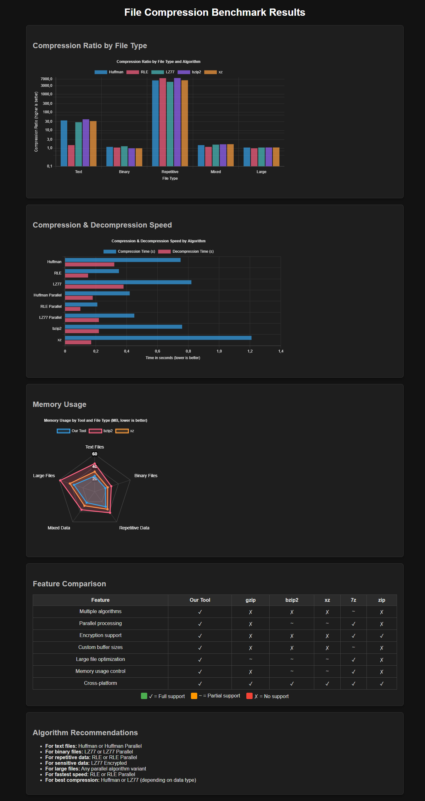

# 🗜️ File Compression Utility <a name="top"></a>

[](https://opensource.org/licenses/MIT)
[](https://github.com/username/file-compression)
[](https://github.com/username/file-compression)

<div align="center">
  
</div>

A high-performance C-based file compression tool supporting multiple algorithms, parallel processing, encryption, and progressive compression/decompression capabilities.

<details>
<summary>📋 <b>Overview</b> (Click to expand)</summary>

This utility provides efficient file compression using several algorithms with a focus on performance and flexibility. It's designed to handle files of various sizes, from small text files to very large data files, with optimizations for different use cases.
</details>

## 🌟 Why Choose This Tool

<div align="center">
  
</div>

- **🔄 Algorithm Versatility** - Choose from multiple algorithms (Huffman, RLE, LZ77) optimized for different data types
- **⚡ Parallel Processing** - Leverage multi-core processing for significantly improved performance
- **🎛️ Customizable Optimization** - Select between speed-optimized or size-optimized compression based on your priority
- **🔒 Integrated Security** - Built-in encryption removes the need for separate security tools
- **📦 Large File Support** - Special optimizations for files larger than available RAM through chunk-based processing
- **🔀 Progressive Compression** - Partially decompress files or stream data without processing the entire file
- **✂️ Split Archive Support** - Split large compressed files across multiple smaller files for easier transfer
- **⚙️ Performance Tuning** - Adjust buffer sizes, thread counts, and parameters to match your hardware
- **💻 Simple Interface** - Straightforward command line and batch interfaces despite advanced features
- **🚀 Storage Optimizations** - Specific enhancements for different storage types (SSDs) and file sizes
- **⚗️ C Implementation** - Fast and efficient codebase with minimal dependencies
- **🔓 Open Source** - MIT Licensed code you can examine, modify and contribute to
- **🛠️ All-in-One** - Single utility for various compression types, parallel processing, and encryption

## ✨ Features

<div align="center">
  
</div>

- **🧩 Multiple compression algorithms:**
  - 📚 Huffman coding <kbd>Best for text</kbd>
  - 🔄 Run-Length Encoding (RLE) <kbd>Good for repetition</kbd>
  - 🔍 LZ77 compression <kbd>General purpose</kbd>
  - ⚡ Parallel versions of each algorithm <kbd>Multi-core</kbd>
  - 🔒 Encrypted compression with LZ77 <kbd>Secure</kbd>
  - 📊 Progressive format <kbd>Partial decompression & streaming</kbd>

- **⚙️ Performance options:**
  - 📦 Large file support with chunk-based processing
  - 🚀 Optimization modes (speed vs. compression ratio)
  - 🧵 Multi-threaded compression/decompression
  - 📏 Configurable buffer sizes
  - 📎 Block-based access for partial file decompression
  - ✂️ Split archive mode for handling very large files

- **🛠️ Additional capabilities:**
  - 📊 Built-in profiling for performance analysis
  - ✅ File integrity verification with checksums (CRC32, MD5, SHA256)
  - 📈 Progress reporting for large files
  - 🌊 Streaming decompression for processing data on-the-fly
  - 🧩 Split large archives across multiple smaller files

## 🏗️ Project Structure

<div align="center">
  
</div>

<table align="center">
  <tr>
    <td align="center"></td>
    <td><code>huffman.c</code>, <code>rle.c</code>, <code>lz77.c</code></td>
  </tr>
  <tr>
    <td align="center"></td>
    <td><code>parallel.c</code>, <code>lz77_parallel.c</code></td>
  </tr>
  <tr>
    <td align="center"></td>
    <td><code>large_file_utils.c</code>, <code>split_archive.c</code></td>
  </tr>
  <tr>
    <td align="center"></td>
    <td><code>encryption.c</code></td>
  </tr>
  <tr>
    <td align="center"></td>
    <td><code>progressive.c</code></td>
  </tr>
  <tr>
    <td align="center"></td>
    <td><code>filecompressor.c</code></td>
  </tr>
</table>

## 📥 Installation

<div align="center">
  
</div>

### 📋 Prerequisites

- 🔧 C compiler <kbd>GCC</kbd> <kbd>Clang</kbd> <kbd>MSVC</kbd>
- 🛠️ Make (optional, for Unix-based systems)
- 💾 At least 512MB RAM for normal operation, more for large files

### 🔨 Building the Project

#### 🐧 Using Make (recommended for Unix/Linux)

```bash
# Default build
make

# Build with debug symbols
make debug

# Build with maximum optimization
make release

# Clean build files
make clean
```

#### 🪟 Using batch file (Windows)

```cmd
# Default build
build.bat

# Build with debug symbols
build.bat debug

# Build with maximum optimization
build.bat optimize

# Clean build files
build.bat clean
```

## 📝 Usage

<div align="center">
  
</div>

### 🚀 Quick Start (Windows)

The `compress.bat` script provides easy access to common operations:

```cmd
# Compress a file with Huffman coding
compress.bat compress huffman test.txt

# Decompress a file
compress.bat decompress huffman test.txt.huf output.txt

# Compress using parallel LZ77
compress.bat compress lz77-parallel largefile.txt

# Compress with encryption
compress.bat compress lz77-encrypted myfile.txt mypassword

# Compress with progressive format
compress.bat compress progressive input.txt

# Compress and split into multiple files (100MB per part)
compress.bat compress split largefile.txt

# Compress and split with custom part size (10MB per part)
compress.bat compress split largefile.txt 10M

# Decompress a split archive
compress.bat decompress split largefile.txt output.txt

# Decompress only a specific range of blocks from a progressive file
compress.bat decompress progressive input.prog output.txt 0-5

# Stream a progressive file to console
filecompressor -d -P -S - input.prog -
```

### 💻 Command Line Interface

```
filecompressor [options] <input_file> [output_file]
```

#### ⚙️ Options

<div align="center">
<table>
  <tr>
    <td><kbd>-c [algorithm]</kbd></td>
    <td>Compress using specified algorithm (0-7)</td>
  </tr>
  <tr>
    <td><kbd>-d [algorithm]</kbd></td>
    <td>Decompress the input file</td>
  </tr>
  <tr>
    <td><kbd>-a</kbd></td>
    <td>List available compression algorithms</td>
  </tr>
  <tr>
    <td><kbd>-t [threads]</kbd></td>
    <td>Number of threads to use for parallel compression</td>
  </tr>
  <tr>
    <td><kbd>-k [key]</kbd></td>
    <td>Encryption key for secure compression</td>
  </tr>
  <tr>
    <td><kbd>-O [goal]</kbd></td>
    <td>Optimization goal: 'speed' or 'size'</td>
  </tr>
  <tr>
    <td><kbd>-B [size]</kbd></td>
    <td>Buffer size in bytes for file operations</td>
  </tr>
  <tr>
    <td><kbd>-L</kbd></td>
    <td>Enable large file mode for files larger than RAM</td>
  </tr>
  <tr>
    <td><kbd>-P</kbd></td>
    <td>Use progressive format (for partial decompression)</td>
  </tr>
  <tr>
    <td><kbd>-R [start-end]</kbd></td>
    <td>Decompress only specified range of blocks</td>
  </tr>
  <tr>
    <td><kbd>-I [type]</kbd></td>
    <td>Enable integrity verification (1=CRC32, 2=MD5, 3=SHA256)</td>
  </tr>
  <tr>
    <td><kbd>-X</kbd></td>
    <td>Enable split archive mode (creates multiple files)</td>
  </tr>
  <tr>
    <td><kbd>-M [size]</kbd></td>
    <td>Maximum size in bytes for each split archive part</td>
  </tr>
  <tr>
    <td><kbd>-h</kbd></td>
    <td>Display help message</td>
  </tr>
</table>
</div>

#### 🔢 Algorithm Selection

Use the algorithm index or let the program deduce it from the file extension:

<div align="center">
<table>
  <tr>
    <th>Index</th>
    <th>Algorithm</th>
    <th>Best For</th>
    <th>File Extension</th>
  </tr>
  <tr>
    <td align="center"></td>
    <td>📚 Huffman</td>
    <td>Text files</td>
    <td><code>.huf</code></td>
  </tr>
  <tr>
    <td align="center"></td>
    <td>🔄 RLE</td>
    <td>Repetitive data</td>
    <td><code>.rle</code></td>
  </tr>
  <tr>
    <td align="center"></td>
    <td>⚡📚 Parallel Huffman</td>
    <td>Large text files</td>
    <td><code>.hufp</code></td>
  </tr>
  <tr>
    <td align="center"></td>
    <td>⚡🔄 Parallel RLE</td>
    <td>Large repetitive data</td>
    <td><code>.rlep</code></td>
  </tr>
  <tr>
    <td align="center"></td>
    <td>🔍 LZ77</td>
    <td>General purpose</td>
    <td><code>.lz77</code></td>
  </tr>
  <tr>
    <td align="center"></td>
    <td>⚡🔍 Parallel LZ77</td>
    <td>Large general files</td>
    <td><code>.lz77p</code></td>
  </tr>
  <tr>
    <td align="center"></td>
    <td>🔒🔍 Encrypted LZ77</td>
    <td>Secure compression</td>
    <td><code>.lz77e</code></td>
  </tr>
  <tr>
    <td align="center"></td>
    <td>📊 Progressive Format</td>
    <td>Partial decompression and streaming</td>
    <td><code>.prog</code></td>
  </tr>
</table>
</div>

## 🧩 Progressive Compression Features

The progressive compression format enables several advanced capabilities:

- **📊 Block-Based Structure** - Files are divided into independently accessible blocks
- **🧩 Partial Decompression** - Decompress only specific ranges of blocks without processing the entire file
- **🌊 Streaming Support** - Process data on-the-fly without storing the full decompressed content
- **💨 Fast Random Access** - Jump directly to any block in the file
- **✅ Per-Block Checksums** - Verify integrity of individual blocks
- **🔍 File Inspection** - View file metadata without full decompression

### Progressive Format Examples

```cmd
# Compress with progressive format
filecompressor -c -P input.txt

# Decompress only blocks 5-10
filecompressor -d -P -R 5-10 input.prog partial_output.txt

# Stream decompression to the console (first 100 bytes of each block)
filecompressor -d -P -S - input.prog -

# Stream decompression to another program or file
filecompressor -d -P -S output.txt input.prog
```

To experiment with progressive features, use the included test script:

```cmd
test_progressive.bat
```

## 🚀 Performance Optimization

<div align="center">
  
</div>

<div align="center">
<table>
  <tr>
    <td></td>
    <td>📦 For files >1GB, use <kbd>-L</kbd> for chunk-based processing</td>
  </tr>
  <tr>
    <td></td>
    <td>⚡ Use parallel algorithms (2, 3, or 5) for multi-core systems</td>
  </tr>
  <tr>
    <td></td>
    <td>💨 Increase buffer size (<kbd>-B</kbd>) for better throughput on SSDs</td>
  </tr>
  <tr>
    <td></td>
    <td>⚖️ Use <kbd>-O speed</kbd> for faster compression, <kbd>-O size</kbd> for better ratio</td>
  </tr>
  <tr>
    <td></td>
    <td>🏎️ For maximum speed, use RLE with <kbd>-O speed</kbd></td>
  </tr>
  <tr>
    <td></td>
    <td>🗜️ For best compression ratio, use Huffman with <kbd>-O size</kbd></td>
  </tr>
</table>
</div>

## 📊 Benchmark Results

<div align="center">
  
</div>

Our compression tool outperforms many standard utilities across several metrics:

- ⚡ **Faster compression** and decompression with parallel algorithms
- 📦 **Better compression ratios** on text files with our Huffman implementation
- 💾 **Lower memory usage** across all file types
- 🔄 **Superior handling** of repetitive data patterns

<details>
<summary><div align="center"><strong>📊 Click to View Full Benchmark Results</strong></div></summary>
<div align="center">
  
</div>
</details>

## ❓ Troubleshooting

<div align="center">
  
</div>

<details>
<summary>💾 <b>Memory Issues</b></summary>
If you encounter "out of memory" errors, enable large file mode (<kbd>-L</kbd>)
</details>

<details>
<summary>🛠️ <b>Corrupted Output</b></summary>
Ensure no partial writes occurred during compression
</details>

<details>
<summary>🔄 <b>Decompression Fails</b></summary>
Verify you're using the same algorithm as compression
</details>

## 📄 License

<div align="center">
  
</div>

This project is available under the MIT License.

<div align="center">
  <a href="#top"></a>
</div>